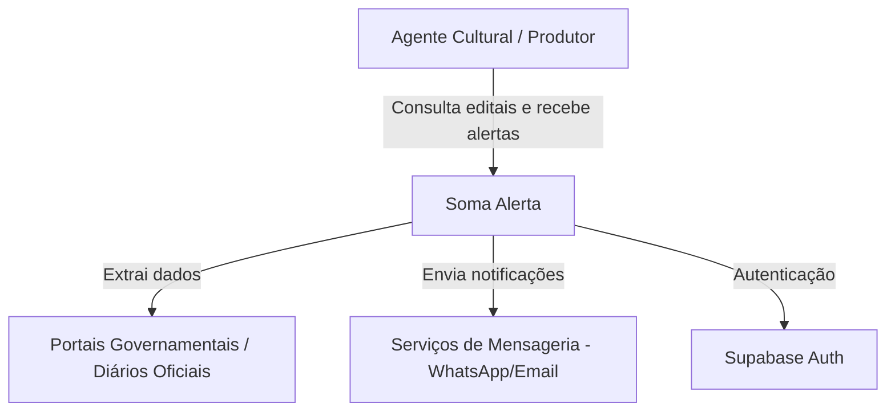
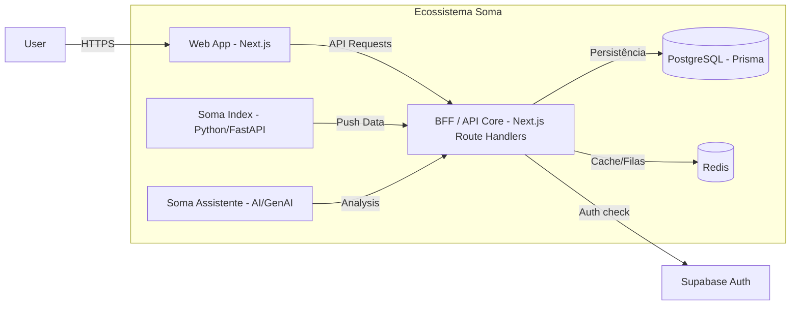
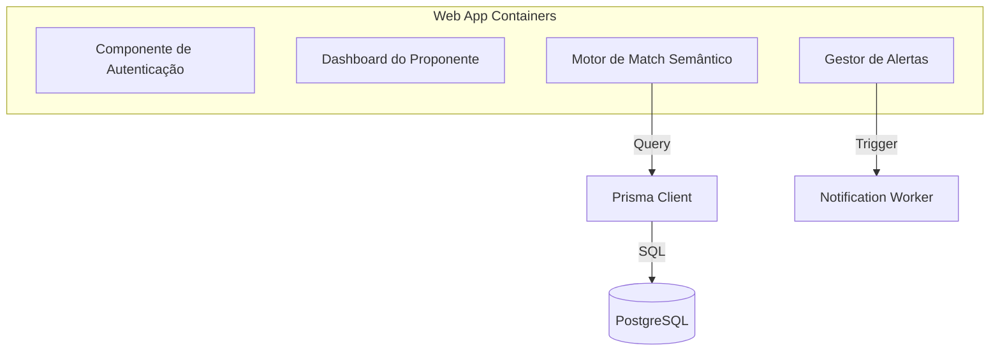

# Modelos C4 - Arquitetura Soma Alerta

Utilizamos a metodologia C4 para descrever a arquitetura do ecossistema de forma multinível.

## Nível 1: Contexto do Sistema

## Nível 2: Containers

## Nível 3: Componentes (Web App / BFF)

